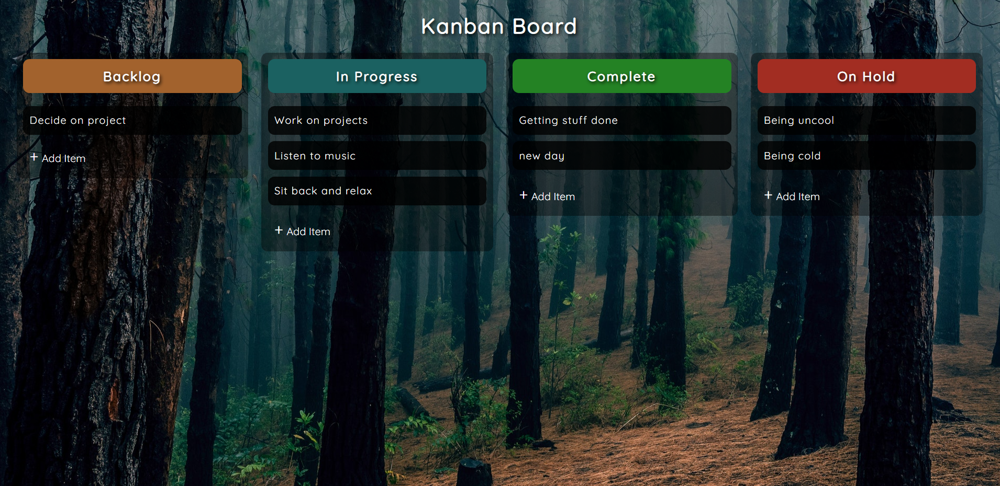

# kanban_board

## Description

A Kanban board that allows a user to create and edit a task. The tasks are stored in local storage Using the drag and drop api each task can be moved across columns. The updated columns are persistant and update the arrays that are stored in local storage. This project was created using HTML, CSS, & JavaScript.

## Demo

A demo of the project can be found here: https://tod619.github.io/kanban_board/
